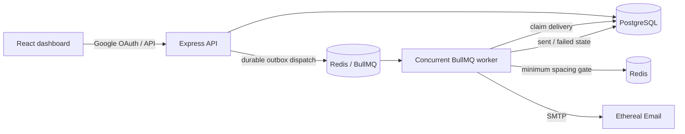

# ReachInbox — Full-stack email scheduler

A TypeScript monorepo for scheduling cold-email deliveries with a persistent PostgreSQL record, BullMQ delayed jobs, Redis-backed limiting, Ethereal SMTP, and a Figma-inspired React dashboard.

  

## What is included

- **Google OAuth sign-in** using the real Google OAuth 2.0 flow, with Redis-backed sessions.
- **Figma-inspired dashboard** with compact sidebar/header, user avatar/name/email, logout, scheduled and sent tabs, loading/empty/error states, and toast feedback.
- **Compose workflow** for subject, body, CSV/text lead upload, address detection/deduplication, start time, sender, inter-email delay, and hourly target.
- **Persistent scheduling** through BullMQ delayed jobs; no cron, polling scheduler, or in-memory timeout is used.
- **Postgres outbox**: the campaign, every delivery, and an outbox record are committed in one transaction before a Redis job is added.
- **Distributed throughput controls**: configurable worker concurrency, a Redis atomic send-spacing gate, and BullMQ’s Redis-backed global hourly limiter.
- **Idempotent jobs**: deterministic BullMQ job IDs and database status claiming prevent replayed/stalled jobs from sending an email twice.
- **Ethereal SMTP** through Nodemailer for safe testing.

## Architecture



### Why this survives restarts

1. Scheduling first writes the campaign, deliveries, and one `QueueOutbox` row per delivery in a single Postgres transaction.
2. Each delivery is then added to BullMQ using a deterministic ID (`delivery-<id>`) and its exact persisted `scheduledFor` delay. BullMQ stores delayed jobs in Redis, so a process restart does not recreate the sequence or reset the timing.
3. At application startup, `dispatchUndispatched()` sends only still-undispatched outbox records to BullMQ. This is startup recovery, **not a cron job**. It covers the small failure window between the DB commit and queue insert.
4. A job atomically changes its row from `SCHEDULED` to `SENDING`. Any replay only sees a non-scheduled row and exits; it cannot hand the same record to SMTP a second time.

SMTP cannot offer a database transaction, so the deliberately chosen guarantee is **at-most-once SMTP handoff**. If the process dies after the row is claimed but before the SMTP result is recorded, the record is eventually shown as failed rather than risk a duplicate email. A stable `Message-ID` provides another idempotency signal to mail infrastructure.

### Throughput behavior

| Control | Configuration | Enforcement |
| --- | --- | --- |
| Parallel work | `WORKER_CONCURRENCY` | BullMQ worker `concurrency` option. |
| Minimum spacing | `MIN_SEND_DELAY_MS` | Atomic Redis Lua gate before every SMTP handoff; manual BullMQ rate limit defers jobs without failing them. |
| Global hourly cap | `MAX_EMAILS_PER_HOUR` | BullMQ Redis-backed limiter, shared by all worker processes and instances. |
| Campaign pace | Compose form delay + hourly target | Delivery timestamps are spaced by `max(delay, 1 hour / campaign hourly target)`. |

The queue-wide hourly limiter is intentionally global: it protects Ethereal/provider capacity even when different senders or multiple app instances schedule work at the same time. When 1,000 jobs have the same due time, BullMQ retains them, workers claim up to the configured concurrency, the Redis gate spaces their actual SMTP handoffs, and jobs beyond `MAX_EMAILS_PER_HOUR` stay delayed by BullMQ until its next capacity window. No email is dropped or permanently failed for being rate limited.

## Run locally

### Prerequisites

- Node.js 20+
- Docker Desktop (recommended) for PostgreSQL and Redis
- A Google Cloud OAuth client configured for Web application sign-in
- An [Ethereal Email account](https://ethereal.email/create)

### 1. Configure services and environment

```bash
docker compose up -d
copy .env.example .env
copy apps\web\.env.example apps\web\.env
```

Fill the following in `.env`:

```dotenv
GOOGLE_CLIENT_ID="your-client-id.apps.googleusercontent.com"
GOOGLE_CLIENT_SECRET="your-google-client-secret"
SESSION_SECRET="a-long-random-value-at-least-24-characters"
SMTP_USER="your-ethereal-username"
SMTP_PASS="your-ethereal-password"
SENDER_ADDRESSES="Outbox <your-ethereal-username@ethereal.email>,Sales <sales@ethereal.email>"
```

In Google Cloud Console add this authorised redirect URI exactly:

```text
http://localhost:4000/auth/google/callback
```

Use the SMTP host/port shown in your Ethereal account. The defaults are `smtp.ethereal.email:587`.

### 2. Install, migrate, and run

```bash
npm install
npm run db:generate
npm run db:migrate -- --name initial
npm run dev:api
```

In a second terminal:

```bash
npm run dev:web
```

Visit [http://localhost:5173](http://localhost:5173), choose **Continue with Google**, and schedule a campaign.

For a production-style build:

```bash
npm run build
npm run start --workspace @reachinbox/api
npm run preview --workspace @reachinbox/web
```

## API reference

All `/api/*` routes require the Google session cookie.

| Method | Route | Purpose |
| --- | --- | --- |
| `GET` | `/auth/google` | Start real Google OAuth. |
| `GET` | `/auth/me` | Current signed-in user. |
| `POST` | `/auth/logout` | Destroy the session. |
| `GET` | `/api/emails?status=scheduled` | Scheduled/sending rows. |
| `GET` | `/api/emails?status=sent` | Sent/failed rows. |
| `GET` | `/api/emails/settings` | Sender options and policy bounds. |
| `POST` | `/api/schedule` | Create an idempotent campaign. |

Example schedule payload:

```json
{
  "recipients": ["alex@example.com", "sam@example.com"],
  "subject": "A quick question",
  "body": "Hi — I would love to share an idea.",
  "startAt": "2026-08-16T08:30:00.000Z",
  "delaySeconds": 2,
  "hourlyLimit": 200,
  "senderAddress": "Outbox <your-ethereal-username@ethereal.email>",
  "idempotencyKey": "0e526d3f-d12a-47f4-928a-728e5baf0f6a"
}
```

`idempotencyKey` is required. Repeating the same request returns the original campaign instead of creating another queue of emails.

## Deploy online with Railway

This repository includes a single-root `Dockerfile` that builds the React dashboard and serves it from Express. That means one public domain, no cross-site session cookie problem, and a single OAuth callback URL.

1. Create a **private GitHub repository**, push this project, and connect it to a new Railway project.
2. Add a **PostgreSQL** service and a **Redis** service from Railway’s database templates.
3. Add a service from your GitHub repository. Railway detects the root `Dockerfile`; do not set a root directory.
4. In the application service, add these variables. Use Railway variable references for the database services:

   ```dotenv
   DATABASE_URL=${{Postgres.DATABASE_URL}}
   REDIS_URL=${{Redis.REDIS_URL}}
   NODE_ENV=production
   PORT=4000
   SESSION_SECRET=<long-random-secret>
   GOOGLE_CLIENT_ID=<google-client-id>
   GOOGLE_CLIENT_SECRET=<google-client-secret>
   SMTP_HOST=smtp.ethereal.email
   SMTP_PORT=587
   SMTP_USER=<ethereal-username>
   SMTP_PASS=<ethereal-password>
   SENDER_ADDRESSES=Outbox <your-ethereal-username@ethereal.email>,Sales <sales@ethereal.email>
   WORKER_CONCURRENCY=5
   MIN_SEND_DELAY_MS=2000
   MAX_EMAILS_PER_HOUR=200
   MAX_CAMPAIGN_DELAY_MS=60000
   MAX_CAMPAIGN_HOURLY_LIMIT=1000
   ```

5. Generate a Railway public domain, for example `https://reachinbox-production.up.railway.app`, then set:

   ```dotenv
   FRONTEND_URL=https://reachinbox-production.up.railway.app
   GOOGLE_CALLBACK_URL=https://reachinbox-production.up.railway.app/auth/google/callback
   ```

6. In Google Cloud Console, update the Web OAuth client:
   - **Authorized JavaScript origin:** `https://reachinbox-production.up.railway.app`
   - **Authorized redirect URI:** `https://reachinbox-production.up.railway.app/auth/google/callback`
7. Redeploy. The container runs `prisma migrate deploy` before starting Express and the BullMQ worker.

Do not commit `.env`, Google credentials, or Ethereal credentials. For the hiring assignment, invite `Mitrajit` and `Yadav036` after making the GitHub repository private.

## Restart demonstration

1. In the dashboard schedule an email for at least two minutes in the future.
2. Stop the API process (`Ctrl+C`) before the due time.
3. Start it again with `npm run dev:api`.
4. The existing delayed BullMQ job remains in Redis and sends at its stored time. The dashboard’s row comes from Postgres, so it remains visible across the restart.

## Assumptions and trade-offs

- The supplied Figma board was used as visual direction for the light mail-client treatment; it did not expose inspectable measurements without editor access, so the dashboard is a close, responsive interpretation rather than pixel-exported assets.
- A single Node process starts both Express and the BullMQ worker for straightforward local use. In a deployment, the same compiled worker module can run in dedicated replicas; Redis ensures the concurrency/limit behavior remains shared.
- The app accepts up to 10,000 parsed addresses per campaign and shows at most 200 rows in each table to keep dashboard responses predictable.
- There is no cron dependency anywhere. Startup outbox recovery is intentionally bounded to 500 records per process boot; production deployments can call the same handler from an administrative retry endpoint or run it during normal process orchestration.

## Verification performed

```text
npm run build
```

This runs Prisma client generation, strict TypeScript compilation for the Express API, strict TypeScript compilation for React, and a Vite production bundle.
